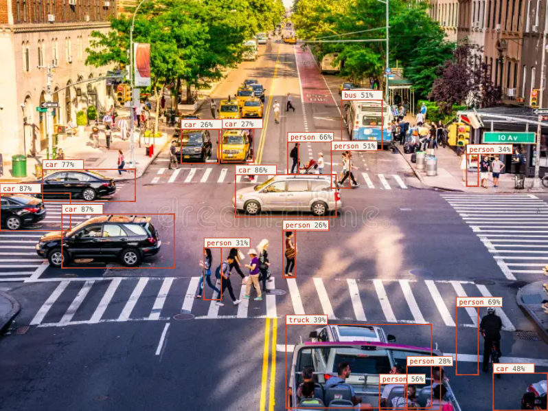
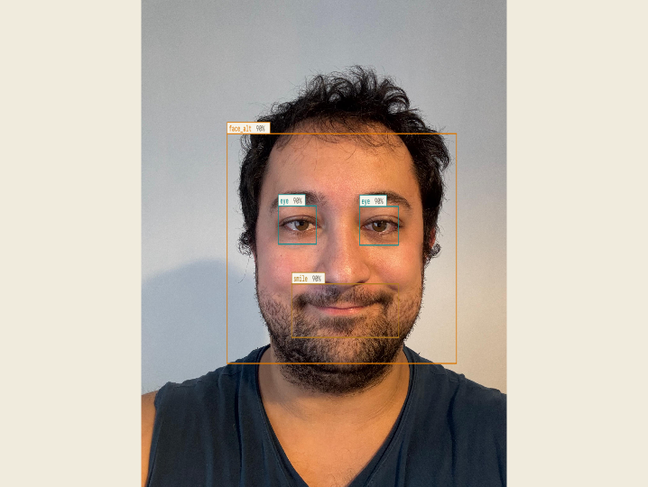
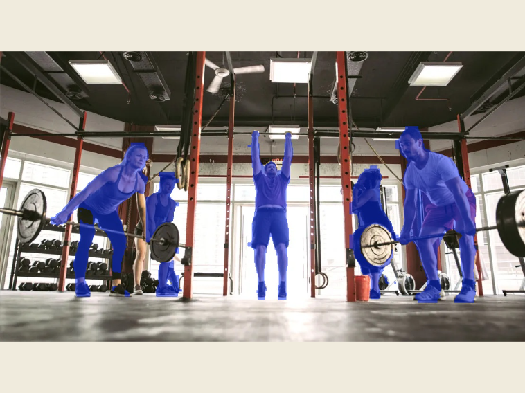
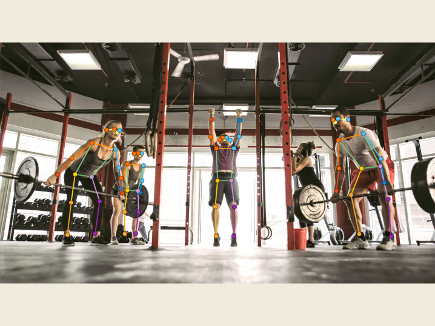

# Argus Vision Studio

Computer vision web application with face recognition, object detection, Haar cascade detection, image segmentation, pose estimation, and captioning/VQA.

### Important Note
There is an 'Info' button at the top-right of each page that provides details about your current page.

## Features

- **Face Recognition** — Register people by photo, recognize them live via webcam or uploaded image. 512-D InsightFace embeddings stored in Qdrant; gallery persists across sessions.
- **Object Detection** — YOLO-based detection with 80 COCO classes
- **Image Segmentation** — YOLO segmentation with mask overlays
- **Haar Cascade Detector** — 12 configurable OpenCV classifiers (face, eye, smile, body, cat face...)
- **Pose Estimation** — Human keypoint detection with skeleton overlays
- **Captioning & VQA** — Local Ollama vision models for image descriptions and visual questions

## Outputs
<p>
  
  
</p>

<p>
  
  
</p>

## Architecture

```
main.py                   # FastAPI app — CORS, static files, router mounts, init_db

frontend/                 # CDN-based React (no build step)
  api.js                  # window.API — wrappers for all backend endpoints
  app.jsx                 # router shell, webcam hook, layout
  pages.jsx               # Face Recognition, Object Detection, Dashboard
  pages2.jsx              # Haar Cascade Detector, Segmentation, Pose Estimation
  pages3.jsx              # Captioning
  primitives.jsx          # Shared UI components
  data.js                 # Static constants (COCO classes, etc.)

data/
  faces.db                # SQLite database (created on first run)
  qdrant/                 # Qdrant vector store (created on first run)
  haarcascades/           # OpenCV cascade XML files

database/
  face_sqlite.py          # SQLite — persons + recognition_logs tables
  face_vector.py          # Qdrant local — 512-D cosine collection

models/                   # Models related to each functionalities are located in this folder
  object_detection
  pose_estimation
  segmentation
  export_coreml.py        # To export yolo26n.pt in CoreML format (optimized for MACOS)

routers/
  face.py
  detection.py
  segment.py
  haardcascade.py
  caption.py

src/                      # ML engine implementations
  face_recognition.py
  object_detection.py
  image_segmentation.py
  haarcascade_detection.py
  
```

## Models

| Model | Task | Backend |
|-------|------|---------|
| InsightFace buffalo_l | Face embedding + detection | CoreML (macOS) / CPU |
| YOLO26n | Object detection | CoreML (macOS) / CPU |
| YOLO26n-seg | Segmentation | CoreML (macOS) / CPU |
| YOLO26n-pose | Pose Estimation | CoreML (macOS) / CPU |
| OpenCV Haar cascades | Classic face/body detection | CPU |
| Ollama vision models | Captioning / VQA | Local Ollama (`localhost:11434`) |

InsightFace buffalo_l is downloaded automatically to `~/.insightface/` on first use.

Captioning requires [Ollama](https://ollama.com) running locally with at least one vision model pulled (e.g. `ollama pull qwen3-vl:2b`).


## Setup

Create and activate a Python virtual environment.

### macOS / Linux

```bash
python3 -m venv .venv
source .venv/bin/activate
python -m pip install --upgrade pip
pip install -r requirements.txt
```

### Windows PowerShell

```powershell
py -m venv .venv
.\.venv\Scripts\Activate.ps1
python -m pip install --upgrade pip
pip install -r requirements.txt
```

If PowerShell blocks activation, run:

```powershell
Set-ExecutionPolicy -ExecutionPolicy RemoteSigned -Scope CurrentUser
```

Then activate again:

```powershell
.\.venv\Scripts\Activate.ps1
```

### Windows Command Prompt

```bat
py -m venv .venv
.\.venv\Scripts\activate.bat
python -m pip install --upgrade pip
pip install -r requirements.txt
```

## Run

```bash
python main.py
```

Open http://localhost:8000
Interactive API docs: http://localhost:8000/docs

## Platform Notes

- **macOS**: CoreML acceleration via `CoreMLExecutionProvider`; webcam via `CAP_AVFOUNDATION`
- **Other platforms**: Falls back to `CPUExecutionProvider`
- Start the server from the project root — database paths (`./data/`) are relative to CWD
